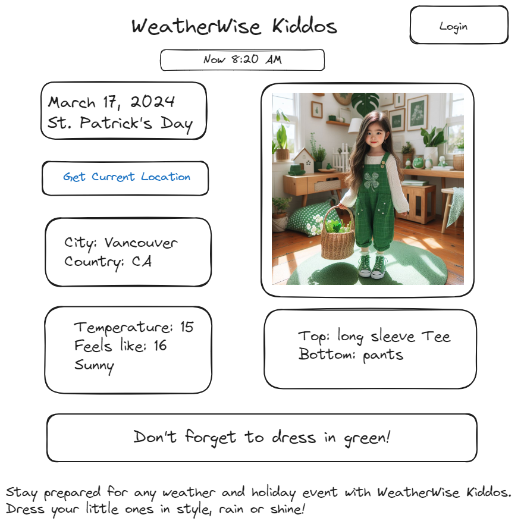
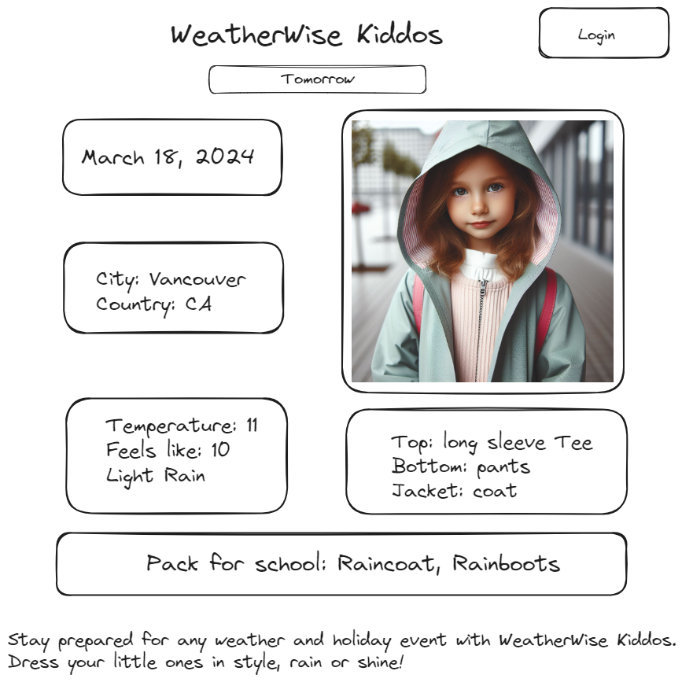
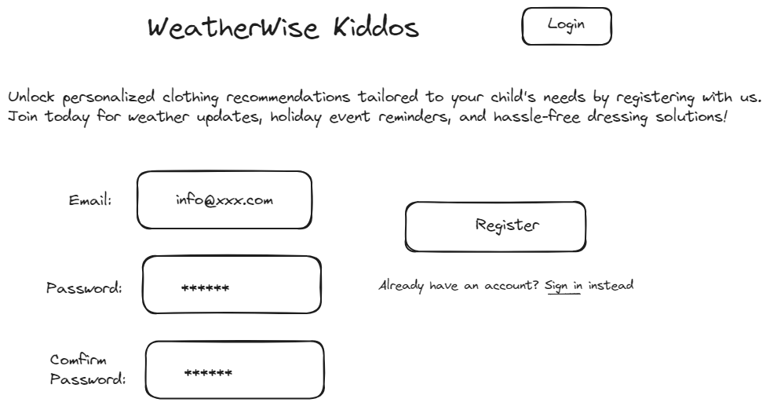
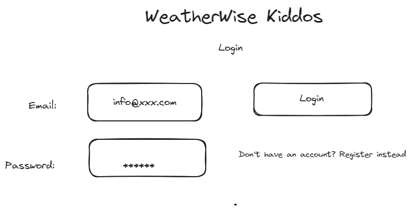
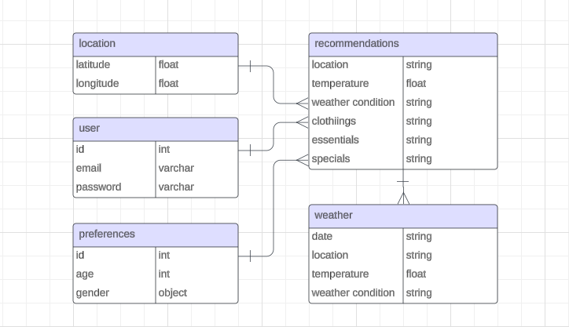

# Project Title
WeatherWise Kiddos

## Overview

"WeatherWise Kiddos" is an app that simplifies parents' mornings by providing daily clothing recommendations for children based on the weather forecast and special events. Additionally, it offers guidance on packing essentials like raincoats, rain boots, sunscreen, and more for school or daycare, ensuring children are ready for the day ahead.

### Problem

Weather-Related Dressing Challenges: Parents find it challenging to dress their children appropriately for changing weather conditions, leading to discomfort or health issues due to inadequate clothing.

Lack of Guidance for Special Occasions: Parents struggle to prepare outfits for special events or holidays, such as themed colors or costumes, resulting in last-minute stress and difficulty finding suitable clothing.

Essential Packing for School or Daycare: Parents may forget to pack essential items like raincoats, boots, sunscreen, hats, and gloves for their children, causing inconvenience or discomfort throughout the day.

Parental Inconsistency: In situations where one parent typically handles dressing the children but is unavailable, the other parent may be unsure of how to dress them properly, leading to confusion and inconsistency in dressing choices.

### User Profile

- Parents and caregivers
    - mainly responsible for dressing children aged 3 to 9 years old
    - seeking assistance due to their children's developmental stage and evolving needs
    - striving for a stress-free morning routine to start the day smoothly

### Features

- As a user, I want to receive today's weatehr information and temperature.
- As a user, I want to receive today's clothing recommendations for kids based on my location and today's weather and temperature.
- As a user, I want to receive today's recommendations on whether to prepare raincoat, rain boots, snow boots, sunscreen, hat or gloves based on the weather forecast.
- As a user, I want to receive clothing recommendations for kids based on today's holiday or event.
- As a user, I want to receive tomorrow's weatehr information and temperature.
- As a user, I want to receive tomorrow's clothing recommendations for kids based on my location and today's weather and temperature.
- As a user, I want to receive tomorrow's recommendations on whether to prepare raincoat, rain boots, snow boots, sunscreen, hat or gloves based on the weather forecast.
- As a user, I want to receive clothing recommendations for kids based on near tomorrow's holiday or event.
- As a user, I want to create an account to receive personalized recommendations based on my kid's age and gender.
- As a user, I want to log in to my account to manage my kid's profiles.
- As a logged in user, I want to provide feedback on the recommendations received, indicating if they were suitable for the weather (hot or cold).
- As a logged in user, I want to update the feedback on the recommendations received.

## Implementation

### Tech Stack

- React
- TypeScript
- MySQL
- Express
- Client libraries: 
    - react
    - react-router
    - axios
- Server libraries:
    - knex
    - express
    - bcrypt for password hashing
    - JWT auth


### APIs

- OpenWeatherMap API for weather data

### Sitemap

- Home page
- Tomorrow
- Register
- Login
- Profile

### Mockups

#### Home Page


#### Tomorrow Page


#### Register Page


#### Login Page


#### Profile Page


### Data



### Endpoints

**GET /today**

- Get today's weather and clothing recommendations, with personalized recommendations if the user is logged in

Parameters:
- longitude: User-provided location as a number
- latitude: User-provided location as a number
- token (optional): JWT used to provide customized recommendations

Response:
```
[
    {
        "id": 1,
        "location": "Vancouver, CA",
        "temperature": 11,
        "weather condition": rain,
        "clothings": "shirt, pants, jacket",
        "essentail": "raincoat, rain pants"
    },
    ...
]
```

**GET /today/:id**

- Get today's weather and clothing recommendations, with an optional "feedback" if the user is logged in

Parameters:
- id: recommendation id as number
- token (optional):  JWT used to add user rating

Response:
```
[
    {
        "id": 1,
        "location": "Vancouver, CA",
        "temperature": 11,
        "weather condition": rain,
        "clothings": "shirt, pants, jacket",
        "essentail": "raincoat, rain pants",
        "feedback": "hot"
    },
    ...
]
```

**GET /tomorrow**

- Get tomorrow's weather and clothing recommendations, with personalized recommendations if the user is logged in

Parameters:
- longitude: User-provided location as a number
- latitude: User-provided location as a number
- token (optional): JWT used to provide customized recommendations

Response:
```
[
    {
        "id": 1,
        "location": "Vancouver, CA",
        "temperature": 11,
        "weather condition": rain,
        "clothings": "shirt, pants, jacket",
        "essentail": "raincoat, rain pants"
    },
    ...
]
```

**GET /tomorrow/:id**

- Get tomorrow's weather and clothing recommendations, with an optional "feedback" if the user is logged in

Parameters:
- id: recommendation id as number
- token (optional):  JWT used to add user rating

Response:
```
[
    {
        "id": 1,
        "location": "Vancouver, CA",
        "temperature": 11,
        "weather condition": rain,
        "clothings": "shirt, pants, jacket",
        "essentail": "raincoat, rain pants",
        "feedback": "cold"
    },
    ...
]
```

**POST /today/:id/feedback**

Logged in user can add their feedback of a recommendation

Parameters:
- id: recommendation id
- token: JWT of the logged in user
- feedback: hot or cold

Response:
```
[
    {
        "id": 1,
        "location": "Vancouver, CA",
        "temperature": 11,
        "weather condition": rain,
        "clothings": "shirt, pants, jacket",
        "essentail": "raincoat, rain pants",
        "feedback": "hot"
    },
    ...
]
```

**PUT /today/:id/feedback**

Logged in user can update their feedback of a recommendation

Parameters:
- id: recommendation id
- token: JWT of the logged in user
- feedback: hot or cold

Response:
```
[
    {
        "id": 1,
        "location": "Vancouver, CA",
        "temperature": 11,
        "weather condition": rain,
        "clothings": "shirt, pants, jacket",
        "essentail": "raincoat, rain pants",
        "feedback": "cold"
    },
    ...
]
```

**POST /users/register**

- Add a user account

Parameters:

- email: User's email
- password: User's provided password

Response:
```
{
    "token": "seyJhbGciOiJIUzI1NiIsInR5cCI6IkpXVCJ9.eyJzdWIiOiIxMjM0NTY3ODkwIiwibmFtZSI6I..."
}
```

**POST /users/login**

- Login a user

Parameters:
- email: User's email
- password: User's provided password

Response:
```
{
    "token": "seyJhbGciOiJIUzI1NiIsInR5cCI6IkpXVCJ9.eyJzdWIiOiIxMjM0NTY3ODkwIiwibmFtZSI6I..."
}
```

### Auth

- JWT auth
    - Before adding auth, all API requests will be using a fake user with id 1
    - Added after core features have first been implemented
    - Store JWT in sessionStorage, remove when a user logs out
    - Add states for logged in showing different UI in places listed in mockups

## Roadmap

- Create client
    - react project with routes and boilerplate pages

- Create server
    - express project with routing, with placeholder 200 responses

- Create migrations

- Gather 10 sample recommendations in different temperature

- Create seeds with sample recommendations data

- Deploy client and server projects so all commits will be reflected in production

- Feature: Show today's weather and clothing recommendations from a given location
    - Implement show today's recommendations page
    - Store given location in sessionStorage
    - Create GET /today endpoint

- Feature: Show tomorrow's weather and clothing recommendations
    - Implement show tomorrow's recommendations page
    - Create GET /tomorrow endpoint

- Feature: Feedback
    - Add buttons to today's recommendations page
    - Create POST /feedback
    - Create PUT /feedback
    - States for add & update feedback

- Feature: Home page

- Feature: Create account
    - Implement register page + form
    - Create POST /users/register endpoint

- Feature: Login
    - Implement login page + form
    - Create POST /users/login endpoint

- Feature: Implement JWT tokens
    - Server: Update expected requests / responses on protected endpoints
    - Client: Store JWT in session storage, include JWT on axios calls

- Bug fixes

- DEMO DAY

## Nice-to-haves

- Change recommendations after logged in user provide feedback with hot or cold.
- Record feedback with user id and recommendation id in database, provide proper recommendations next time.
- Allow users to provide feedback on yesterday's recommendations and upate the database to provide proper ones next time.
- Detailed clothing recommendations with each piece listed.
- Personalized recommendations based on kid's preferences.
- Allow users to set reminders for special events like pajama day or school holidays.
- Reminders for upcoming holidays or events.
- Shopping reminders with links.
- Birthday or family celebration event reminders.
- Expand rating system based each piece of clothing.
- Ability to upload images of kid's clothes.
- Expanded user information including full name and favorite clothes
- Forgot password functionality.
- Unit and Integration Tests.
